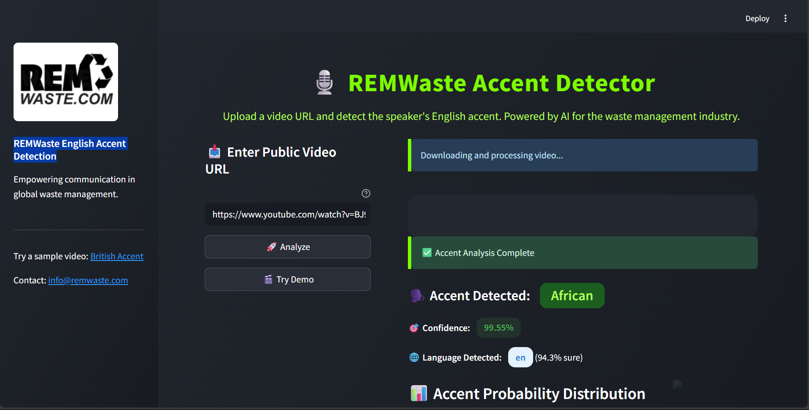
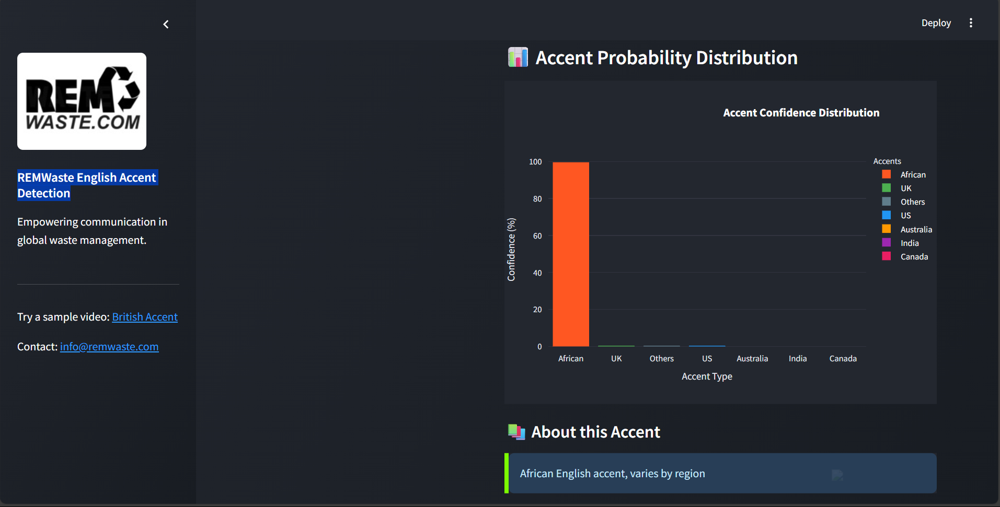
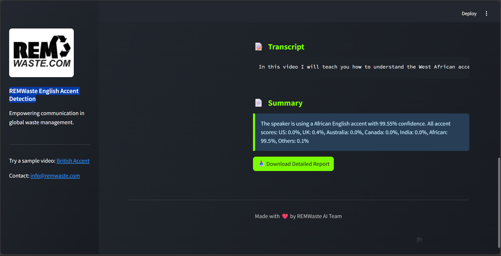

# REMWaste Accent Detector

An AI-powered tool for detecting English accents in speech, designed for REMWaste Company's global waste management communications. Try it live at: [Accent Detector App](https://remwaste-accent-detector.streamlit.app)

## Features

- 🎯 Real-time accent detection from video URLs
- 🌍 Support for multiple English accents:
  - US English
  - UK English
  - Australian English
  - Canadian English
  - Indian English
  - African English
- 🔍 Language verification
- 📝 Automatic transcription
- 📊 Visual accent probability analysis
- 📥 Downloadable reports

## Screenshots

### Main Interface

*Input your video URL and get instant accent analysis*

### Accent Analysis

*Detailed breakdown of accent probabilities*

### Report Generation

*Comprehensive reports with transcription*

## Local Development

### Prerequisites
- Python 3.8 or higher
- FFmpeg installed on your system

### Setup
1. Clone the repository:
```bash
git clone https://github.com/mostafaeslam/Accent-Detector.git
cd accent-detector
```

2. Create and activate virtual environment:
```bash
python -m venv venv
source venv/bin/activate  # On Windows: venv\Scripts\activate
```

3. Install dependencies:
```bash
pip install -r requirements.txt
```

4. Run locally:
```bash
streamlit run app/main.py
```

## Project Structure
```
accent-detector/
├── app/
│   ├── main.py          # Streamlit interface
│   └── routes.py        # URL handling
├── core/
│   └── accent_analyzer.py    # Core analysis logic
├── services/
│   ├── accent_classifier_hf.py   # Accent detection
│   ├── language_detector.py      # Language detection
│   └── whisper_service.py        # Speech transcription
├── images/              # Screenshots and assets
├── models/             # Model storage (auto-downloaded)
├── requirements.txt    # Python dependencies
└── README.md
```

## Using the App

1. Visit the [Accent Detector App](https://your-app-name.streamlit.app)
2. Paste a video URL (YouTube, direct MP4, etc.)
3. Click "Analyze"
4. View the results:
   - Detected accent with confidence score
   - Full accent probability distribution
   - Language verification
   - Complete transcription
5. Download the analysis report

## Example URLs for Testing
- British Accent: `https://www.youtube.com/watch?v=swb7lMQHkVE`
- American Accent: `https://www.youtube.com/watch?v=example1`
- Australian Accent: `https://www.youtube.com/watch?v=example2`

## Support

For issues or questions:
- Create an issue on GitHub
- Contact: mostafaeslam1220@gmail.com

## License

This project is licensed under the MIT License.
